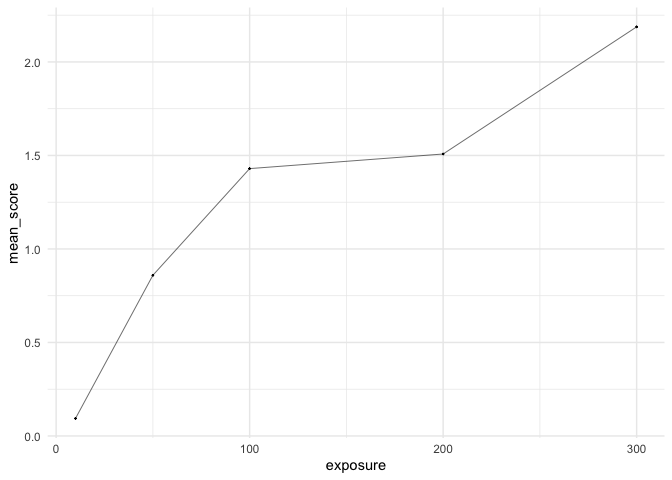

<!-- README.md is generated from README.Rmd. Please edit that file -->

# RStanTVA

<!-- badges: start -->
<!-- badges: end -->

RStanTVA is an R package containing the StanTVA library and numerous
convenience functions for generating, compiling, fitting, and analyzing
(Stan)TVA models.

## Installation

You can install the development version of RStanTVA from
[GitHub](https://github.com/mmrabe/RStanTVA) with:

``` r
remotes::install_github("mmrabe/RStanTVA")
```

## Example

Load the R package:

``` r
library(RStanTVA)
#> Loading required package: rstan
#> Loading required package: StanHeaders
#> 
#> rstan version 2.32.6 (Stan version 2.32.2)
#> For execution on a local, multicore CPU with excess RAM we recommend calling
#> options(mc.cores = parallel::detectCores()).
#> To avoid recompilation of unchanged Stan programs, we recommend calling
#> rstan_options(auto_write = TRUE)
#> For within-chain threading using `reduce_sum()` or `map_rect()` Stan functions,
#> change `threads_per_chain` option:
#> rstan_options(threads_per_chain = 1)
library(tidyverse)
#> ── Attaching core tidyverse packages ──────────────────────── tidyverse 2.0.0 ──
#> ✔ dplyr     1.1.4     ✔ readr     2.1.5
#> ✔ forcats   1.0.0     ✔ stringr   1.5.1
#> ✔ ggplot2   3.5.0     ✔ tibble    3.2.1
#> ✔ lubridate 1.9.3     ✔ tidyr     1.3.1
#> ✔ purrr     1.0.2
#> ── Conflicts ────────────────────────────────────────── tidyverse_conflicts() ──
#> ✖ tidyr::extract() masks rstan::extract()
#> ✖ dplyr::filter()  masks stats::filter()
#> ✖ dplyr::lag()     masks stats::lag()
#> ℹ Use the conflicted package (<http://conflicted.r-lib.org/>) to force all conflicts to become errors
```

Load example data from the parameter recovery study:

``` r
tva_data <- tva_recovery %>% filter(subject == 20)
tva_data
#> # A tibble: 512 × 9
#> # Groups:   subject [1]
#>    subject trial     T condition type  S[,1]  [,2] D[,1] R[,1] true_values$t[,1]
#>      <int> <int> <dbl> <fct>     <fct> <int> <int> <int> <int>             <dbl>
#>  1      20     1    10 high      WR        1     1     0     0              26.1
#>  2      20     2    10 low       WR        1     1     0     0              56.4
#>  3      20     3    50 high      WR        1     1     0     0             139. 
#>  4      20     4    50 high      PR        1     1     0     0              72.6
#>  5      20     5    50 low       WR        1     1     0     0              62.9
#>  6      20     6    50 low       PR        1     1     0     0              95.7
#>  7      20     7   100 high      WR        1     1     0     1              37.8
#>  8      20     8   100 high      PR        1     1     1     0             118. 
#>  9      20     9   100 low       WR        1     1     0     0             125. 
#> 10      20    10   100 low       PR        1     1     1     0              77.3
#> # ℹ 502 more rows
#> # ℹ 13 more variables: S[3:4] <int>, D[2:4] <int>, R[2:4] <int>,
#> #   true_values$t[2:6] <dbl>, true_values$v <dbl[,6]>, $t0 <dbl>, $K <int>,
#> #   $C <dbl>, $alpha <dbl>, $w <dbl[,4]>, $mu0 <dbl>, $sigma0 <dbl>,
#> #   $pK <dbl[,5]>
```

Create a report and visualize the scores:

``` r
tva_data_report <- tva_report(tva_data)
tva_data_report
#> # A tibble: 512 × 6
#>    condition exposure score n_items n_distractors n_targets
#>    <fct>        <dbl> <int>   <int>         <int>     <int>
#>  1 high            10     0       4             0         4
#>  2 low             10     0       4             0         4
#>  3 high            50     1       4             0         4
#>  4 high            50     0       4             2         2
#>  5 low             50     1       4             0         4
#>  6 low             50     0       4             2         2
#>  7 high           100     4       4             0         4
#>  8 high           100     0       4             2         2
#>  9 low            100     2       4             0         4
#> 10 low            100     2       4             2         2
#> # ℹ 502 more rows


tva_data_report %>%
  group_by(exposure) %>%
  summarize(mean_score = mean(score)) %>%
  ggplot(aes(exposure, mean_score)) +
  theme_minimal() +
  geom_point(size = 0.2) +
  geom_line(linewidth = 0.2)
```



Generate a StanTVA model for partial report of 6 display locations with
Gaussian $t_0$ and a free $K$ distribution:

``` r
library(RStanTVA)

tva_model <- stantva_model(
  location = 4,
  task = "pr",
  w_mode = "locations",
  t0_mode = "gaussian",
  K_mode = "free",
  sanity_checks = FALSE,
  priors = FALSE
)
#> Trying to compile a simple C file
#> Running /Library/Frameworks/R.framework/Resources/bin/R CMD SHLIB foo.c
#> using C compiler: ‘Apple clang version 16.0.0 (clang-1600.0.26.4)’
#> using SDK: ‘MacOSX15.1.sdk’
#> clang -arch arm64 -I"/Library/Frameworks/R.framework/Resources/include" -DNDEBUG   -I"/Library/Frameworks/R.framework/Versions/4.3-arm64/Resources/library/Rcpp/include/"  -I"/Library/Frameworks/R.framework/Versions/4.3-arm64/Resources/library/RcppEigen/include/"  -I"/Library/Frameworks/R.framework/Versions/4.3-arm64/Resources/library/RcppEigen/include/unsupported"  -I"/Library/Frameworks/R.framework/Versions/4.3-arm64/Resources/library/BH/include" -I"/Library/Frameworks/R.framework/Versions/4.3-arm64/Resources/library/StanHeaders/include/src/"  -I"/Library/Frameworks/R.framework/Versions/4.3-arm64/Resources/library/StanHeaders/include/"  -I"/Library/Frameworks/R.framework/Versions/4.3-arm64/Resources/library/RcppParallel/include/"  -I"/Library/Frameworks/R.framework/Versions/4.3-arm64/Resources/library/rstan/include" -DEIGEN_NO_DEBUG  -DBOOST_DISABLE_ASSERTS  -DBOOST_PENDING_INTEGER_LOG2_HPP  -DSTAN_THREADS  -DUSE_STANC3 -DSTRICT_R_HEADERS  -DBOOST_PHOENIX_NO_VARIADIC_EXPRESSION  -D_HAS_AUTO_PTR_ETC=0  -include '/Library/Frameworks/R.framework/Versions/4.3-arm64/Resources/library/StanHeaders/include/stan/math/prim/fun/Eigen.hpp'  -D_REENTRANT -DRCPP_PARALLEL_USE_TBB=1   -I/opt/R/arm64/include    -fPIC  -falign-functions=64 -Wall -g -O2  -c foo.c -o foo.o
#> In file included from <built-in>:1:
#> In file included from /Library/Frameworks/R.framework/Versions/4.3-arm64/Resources/library/StanHeaders/include/stan/math/prim/fun/Eigen.hpp:22:
#> In file included from /Library/Frameworks/R.framework/Versions/4.3-arm64/Resources/library/RcppEigen/include/Eigen/Dense:1:
#> In file included from /Library/Frameworks/R.framework/Versions/4.3-arm64/Resources/library/RcppEigen/include/Eigen/Core:19:
#> /Library/Frameworks/R.framework/Versions/4.3-arm64/Resources/library/RcppEigen/include/Eigen/src/Core/util/Macros.h:679:10: fatal error: 'cmath' file not found
#>   679 | #include <cmath>
#>       |          ^~~~~~~
#> 1 error generated.
#> make: *** [foo.o] Error 1

tva_model
#> StanTVA model with 6 free parameter(s) and the following configuration:
#>   - locations = 4
#>   - task = "pr"
#>   - regions = list()
#>   - C_mode = "equal"
#>   - w_mode = "locations"
#>   - t0_mode = "gaussian"
#>   - K_mode = "free"
#>   - parallel = FALSE
#>   - save_log_lik = FALSE
#>   - priors = FALSE
#>   - sanity_checks = FALSE
```

The generated Stan model looks like this:

``` stan
/*************************************************************************************
 *  StanTVA
 *  =======
 *  This is a StanTVA program, generated with RStanTVA. Please cite as:
 *  
 *  Rabe M, Kyllingsbæk S (2024). _RStanTVA: TVA models in Stan using R and
 *  StanTVA_. R package version 0.1.0.
 *  
 *  Configuration
 *  =============
 *  - formula = NULL
 *  - locations = 4
 *  - task = pr
 *  - regions = list()
 *  - C_mode = equal
 *  - w_mode = locations
 *  - t0_mode = gaussian
 *  - K_mode = free
 *  - parallel = FALSE
 *  - save_log_lik = FALSE
 *  - priors = FALSE
 *  - sanity_checks = FALSE
 *  
 *  License
 *  =======
 *  StanTVA and RStanTVA are licensed under the GNU General Public License 3. For a
 *  copy of the license agreement, see: https://www.gnu.org/licenses/gpl-3.0.html
 *************************************************************************************/

functions {
    #include tva.stan
    #include freeK.stan
    #include gaussiant0.stan
    vector calculate_v(data int nS, data array[] int S, data array[] int D, vector w, real C, real alpha) {
        vector[4] s = rep_vector(C, 4);
        array[nS] int Ss = get_matches(S);
        vector[4] w_alpha = w;
        for(i in 1:4) if(D[i]) w_alpha[i] *= alpha;
        vector[nS] v = s[Ss] .* w_alpha[Ss] / sum(w_alpha[Ss]);
        for(i in 1:nS) if(v[i] < machine_precision()) v[i] = machine_precision();
        return v/1000.0;
    }
    real log_lik_single(data array[] int S, data array[] int D, data array[] int R, data int nS, data real T, vector w, real C, real alpha, vector pK, real mu0, real sigma0) {
        real log_lik;
        vector[nS] v = calculate_v(nS, S, D, to_vector(w), C, alpha);
        log_lik = tva_pr_log(R, S, D, T, [mu0, sigma0]', pK, v);
        if(0 && log_lik == negative_infinity()) print("logLik(S=",S,",D=",D,",R=",R,",nS=",nS,",T=",T,"|to_vector(w)=",to_vector(w),",C=",C,",alpha=",alpha,",to_vector(pK)=",to_vector(pK),",mu0=",mu0,",sigma0=",sigma0,") = -inf !");
        return log_lik;
    }
}
data {
    int<lower=1> N;
    array[N] real<lower=0> T;
    array[N,4] int<lower=0,upper=1> S;
    array[N,4] int<lower=0,upper=1> R;
    array[N,4] int<lower=0,upper=1> D;
}
transformed data {
    array[N] int nS;
    for(i in 1:N) nS[i] = sum(S[i,]);
    int total_nS = sum(nS);
}
parameters {
    real<lower=machine_precision()> C;
    simplex[4] w;
    simplex[5] pK;
    real mu0;
    real<lower=machine_precision()> sigma0;
    real<lower=machine_precision()> alpha;
}
model {
    // likelihood (only if prior != 0)
    if(target() != negative_infinity()) {
        for(i in 1:N) target += log_lik_single(S[i], D[i], R[i], nS[i], T[i], to_vector(w), C, alpha, to_vector(pK), mu0, sigma0);
    }
}
```

Fit `tva_model` to the `tva_data` using maximum-likelihood estimation
(MLE):

``` r
tva_fit <- optimizing(tva_model, tva_data)
str(tva_fit)
#> List of 4
#>  $ par        : Named num [1:13] 87.008 0.302 0.298 0.189 0.211 ...
#>   ..- attr(*, "names")= chr [1:13] "C" "w[1]" "w[2]" "w[3]" ...
#>  $ value      : num -931
#>  $ return_code: int 0
#>  $ theta_tilde: num [1, 1:13] 87.008 0.302 0.298 0.189 0.211 ...
#>   ..- attr(*, "dimnames")=List of 2
#>   .. ..$ : NULL
#>   .. ..$ : chr [1:13] "C" "w[1]" "w[2]" "w[3]" ...
tva_fit$par[c("C","alpha","mu0","sigma0")]
#>          C      alpha        mu0     sigma0 
#> 87.0082930  0.6165499 24.3496886 14.5934136
```
