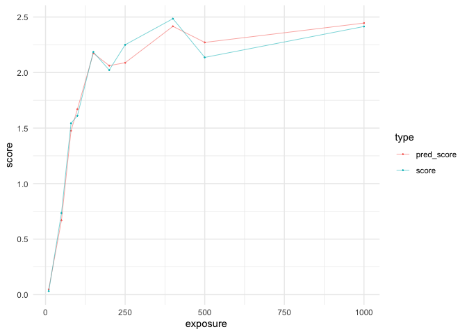

<!-- README.md is generated from README.Rmd. Please edit that file -->

# RStanTVA

<!-- badges: start -->
<!-- badges: end -->

RStanTVA is an R package containing the StanTVA library and numerous
convenience functions for generating, compiling, fitting, and analyzing
(Stan)TVA models.

## Installation

You can install the development version of RStanTVA from
[GitHub](https://github.com/mmrabe/RStanTVA) with:

``` r
remotes::install_github("mmrabe/RStanTVA")
```

## Example

Load the R package:

``` r
library(RStanTVA)
#> Loading required package: dplyr
#> 
#> Attaching package: 'dplyr'
#> The following objects are masked from 'package:stats':
#> 
#>     filter, lag
#> The following objects are masked from 'package:base':
#> 
#>     intersect, setdiff, setequal, union
#> Loading required package: readr
#> Loading required package: rstan
#> Loading required package: StanHeaders
#> 
#> rstan version 2.32.6 (Stan version 2.32.2)
#> For execution on a local, multicore CPU with excess RAM we recommend calling
#> options(mc.cores = parallel::detectCores()).
#> To avoid recompilation of unchanged Stan programs, we recommend calling
#> rstan_options(auto_write = TRUE)
#> For within-chain threading using `reduce_sum()` or `map_rect()` Stan functions,
#> change `threads_per_chain` option:
#> rstan_options(threads_per_chain = 1)
#> Loading required package: tidyr
#> 
#> Attaching package: 'tidyr'
#> The following object is masked from 'package:rstan':
#> 
#>     extract
#> Loading required package: tibble
#> Loading required package: cli
```

Load example data from the parameter recovery study:

``` r
tva_file_name <- file.path(find.package("RStanTVA"), "extdata", "recovery", paste0("recovery_120.dat"))
tva_data <- read_tva_data(tva_file_name)
tva_data
#> TVA data containing 400 whole- and/or partial-report trial(s)
#> Formal class 'tvadata' [package "RStanTVA"] with 1 slot
#>   ..@ .Data:List of 8
#>   .. ..$ : int [1:400] 11 29 54 16 51 27 2 43 34 52 ...
#>   .. ..$ : int [1:400, 1:6] 1 1 1 1 1 0 0 0 0 0 ...
#>   .. ..$ : int [1:400, 1:6] 0 0 0 0 1 0 0 0 0 0 ...
#>   .. ..$ : chr [1:400, 1:6] "A" "I" "O" "N" ...
#>   .. ..$ : num [1:400] 50 150 500 80 500 150 10 400 200 500 ...
#>   .. ..$ : int [1:400, 1:6] 0 0 1 0 0 0 0 0 0 0 ...
#>   .. ..$ : int 400
#>   .. ..$ : int 6
#>   ..$ names: chr [1:8] "condition" "S" "D" "items" ...
```

Create a report and visualize the scores:

``` r
tva_data_report <- tva_report(tva_data)
tva_data_report
#> # A tibble: 400 × 6
#>    condition exposure score n_items n_distractors n_targets
#>        <int>    <dbl> <int>   <int>         <int>     <int>
#>  1        11       50     0       6             3         3
#>  2        29      150     2       6             3         3
#>  3        54      500     6       6             0         6
#>  4        16       80     1       4             0         4
#>  5        51      500     2       4             2         2
#>  6        27      150     2       4             2         2
#>  7         2       10     0       2             0         2
#>  8        43      400     1       2             1         1
#>  9        34      200     3       4             0         4
#> 10        52      500     3       4             0         4
#> # ℹ 390 more rows

library(tidyverse)
#> ── Attaching core tidyverse packages ──────────────────────── tidyverse 2.0.0 ──
#> ✔ forcats   1.0.0     ✔ purrr     1.0.2
#> ✔ ggplot2   3.5.0     ✔ stringr   1.5.1
#> ✔ lubridate 1.9.3     
#> ── Conflicts ────────────────────────────────────────── tidyverse_conflicts() ──
#> ✖ tidyr::extract() masks rstan::extract()
#> ✖ dplyr::filter()  masks stats::filter()
#> ✖ dplyr::lag()     masks stats::lag()
#> ℹ Use the conflicted package (<http://conflicted.r-lib.org/>) to force all conflicts to become errors

tva_data_report %>%
  group_by(exposure) %>%
  summarize(mean_score = mean(score)) %>%
  ggplot(aes(exposure, mean_score)) +
  theme_minimal() +
  geom_point(size = 0.2) +
  geom_line(linewidth = 0.2)
```


Generate a StanTVA model for partial report of 6 display locations with
Gaussian $t_0$ and a free $K$ distribution:

``` r
library(RStanTVA)

tva_model <- stantva_model(
  location = 6,
  task = "pr",
  w_mode = "locations",
  t0_mode = "gaussian",
  K_mode = "free",
  predict = TRUE
)
#> Trying to compile a simple C file
#> Running /Library/Frameworks/R.framework/Resources/bin/R CMD SHLIB foo.c
#> using C compiler: ‘Apple clang version 15.0.0 (clang-1500.3.9.4)’
#> using SDK: ‘MacOSX14.4.sdk’
#> clang -arch arm64 -I"/Library/Frameworks/R.framework/Resources/include" -DNDEBUG   -I"/Library/Frameworks/R.framework/Versions/4.3-arm64/Resources/library/Rcpp/include/"  -I"/Library/Frameworks/R.framework/Versions/4.3-arm64/Resources/library/RcppEigen/include/"  -I"/Library/Frameworks/R.framework/Versions/4.3-arm64/Resources/library/RcppEigen/include/unsupported"  -I"/Library/Frameworks/R.framework/Versions/4.3-arm64/Resources/library/BH/include" -I"/Library/Frameworks/R.framework/Versions/4.3-arm64/Resources/library/StanHeaders/include/src/"  -I"/Library/Frameworks/R.framework/Versions/4.3-arm64/Resources/library/StanHeaders/include/"  -I"/Library/Frameworks/R.framework/Versions/4.3-arm64/Resources/library/RcppParallel/include/"  -I"/Library/Frameworks/R.framework/Versions/4.3-arm64/Resources/library/rstan/include" -DEIGEN_NO_DEBUG  -DBOOST_DISABLE_ASSERTS  -DBOOST_PENDING_INTEGER_LOG2_HPP  -DSTAN_THREADS  -DUSE_STANC3 -DSTRICT_R_HEADERS  -DBOOST_PHOENIX_NO_VARIADIC_EXPRESSION  -D_HAS_AUTO_PTR_ETC=0  -include '/Library/Frameworks/R.framework/Versions/4.3-arm64/Resources/library/StanHeaders/include/stan/math/prim/fun/Eigen.hpp'  -D_REENTRANT -DRCPP_PARALLEL_USE_TBB=1   -I/opt/R/arm64/include    -fPIC  -falign-functions=64 -Wall -g -O2  -c foo.c -o foo.o
#> In file included from <built-in>:1:
#> In file included from /Library/Frameworks/R.framework/Versions/4.3-arm64/Resources/library/StanHeaders/include/stan/math/prim/fun/Eigen.hpp:22:
#> In file included from /Library/Frameworks/R.framework/Versions/4.3-arm64/Resources/library/RcppEigen/include/Eigen/Dense:1:
#> In file included from /Library/Frameworks/R.framework/Versions/4.3-arm64/Resources/library/RcppEigen/include/Eigen/Core:19:
#> /Library/Frameworks/R.framework/Versions/4.3-arm64/Resources/library/RcppEigen/include/Eigen/src/Core/util/Macros.h:679:10: fatal error: 'cmath' file not found
#> #include <cmath>
#>          ^~~~~~~
#> 1 error generated.
#> make: *** [foo.o] Error 1

tva_model
#> StanTVA model with following configuration:
#>   - locations = 6 
#>   - task = "pr" 
#>   - regions = list() 
#>   - C_mode = "equal" 
#>   - w_mode = "locations" 
#>   - t0_mode = "gaussian" 
#>   - K_mode = "free" 
#>   - parallel = FALSE 
#>   - save_log_lik = FALSE 
#>   - predict_scores = TRUE 
#>   - priors = FALSE 
#>   - sanity_checks = FALSE 
#>   - simulate = FALSE 
#>   - type = "stan"
```

Fit `tva_model` to the `tva_data` using maximum-likelihood estimation
(MLE):

``` r
tva_fit <- optimizing(tva_model, tva_data)
str(tva_fit)
#> List of 4
#>  $ par        : Named num [1:2824] 59.8138 0.2254 0.0574 0.182 0.0543 ...
#>   ..- attr(*, "names")= chr [1:2824] "C" "w[1]" "w[2]" "w[3]" ...
#>  $ value      : num -544
#>  $ return_code: int 0
#>  $ theta_tilde: num [1, 1:2824] 59.8138 0.2254 0.0574 0.182 0.0543 ...
#>   ..- attr(*, "dimnames")=List of 2
#>   .. ..$ : NULL
#>   .. ..$ : chr [1:2824] "C" "w[1]" "w[2]" "w[3]" ...
tva_fit$par[c("C","alpha","mu0","sigma0","mK")]
#>          C      alpha        mu0     sigma0         mK 
#> 59.8138042  1.7024483  9.4218619  0.1366502  4.4831927
```

Predicted scores vs. empirical scores:

``` r
tva_data_report %>% 
  mutate(pred_score = tva_fit$par[sprintf("pred_scores[%d,2]",seq_len(n()))] + 2*tva_fit$par[sprintf("pred_scores[%d,3]",seq_len(n()))]+3*tva_fit$par[sprintf("pred_scores[%d,4]",seq_len(n()))]+4*tva_fit$par[sprintf("pred_scores[%d,5]",seq_len(n()))]+5*tva_fit$par[sprintf("pred_scores[%d,6]",seq_len(n()))]+6*tva_fit$par[sprintf("pred_scores[%d,7]",seq_len(n()))]) %>%
  pivot_longer(c(score,pred_score), names_to = "type", values_to = "score") %>%
  group_by(exposure,type) %>%
  summarize(score = mean(score)) %>%
  ggplot(aes(exposure, score, color = type, group = type)) +
  theme_minimal() +
  geom_point(size = 0.2) +
  geom_line(linewidth = 0.2)
#> `summarise()` has grouped output by 'exposure'. You can override using the
#> `.groups` argument.
```


